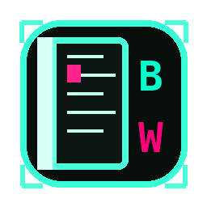

<div align="center">



# BOOKWRITER
### `// CYBER-EDITION`

**WPF-приложение для писателей с cyberpunk-интерфейсом**

[](https://dotnet.microsoft.com/download/dotnet/8.0)
[](https://github.com)
[](LICENSE)
[](https://www.questpdf.com)

</div>

---

## ⚡ О проекте

**BookWriter** — десктопное приложение для написания книг на Windows, выполненное в стиле cyberpunk. Поддерживает структуру «книга → главы», RTF-редактор с форматированием, экспорт в PDF и EPUB, историю версий и SQLite-библиотеку всех проектов.

```
 ╔══════════════════════════════════════════╗
 ║  [ CHAPTER LIST ]  [ RTF EDITOR ]        ║
 ║  ──────────────── ────────────────────── ║
 ║  > Глава 1        Lorem ipsum dolor sit  ║
 ║    Глава 2        amet consectetur...    ║
 ║    Глава 3        _                      ║
 ║  ──────────────── ────────────────────── ║
 ║  STATUS: // READY        слов: 12 340    ║
 ╚══════════════════════════════════════════╝
```

---

## ✨ Возможности

- **RTF-редактор** — жирный, курсив, подчёркивание, заголовки, списки
- **Экспорт в PDF** — обложка, титульная страница, колонтитулы (QuestPDF)
- **Экспорт в EPUB 3** — полная структура, NCX + nav, cover.jpg
- **SQLite-библиотека** — все книги и история версий хранятся в `%APPDATA%\BookWriter\library.db`
- **Автосохранение** — каждые 2 минуты, незаметно
- **Редактор обложки** — front + back cover в PNG/JPEG
- **История версий** — до 50 ревизий на главу
- **Два варианта темы** — Cyberpunk Cyan и Cyberpunk Pink
- **Перетаскивание глав** — меняй порядок через кнопки ↑↓

---

## 🚀 Быстрый старт

### Требования
- Windows 10 / 11 x64
- [.NET 8 SDK](https://dotnet.microsoft.com/download/dotnet/8.0)

### Запуск из исходников

```bash
git clone https://github.com/YOUR_USERNAME/BookWriter.git
cd BookWriter/BookWriter
dotnet run
```

### Сборка в один `.exe`

```bash
dotnet publish -c Release -r win-x64 \
  --self-contained true \
  -p:PublishSingleFile=true \
  -o ./publish
```

Результат: `publish/BookWriter.exe` (~80–120 MB, не требует установки .NET)

---

## 🗂 Структура проекта

```
BookWriter/
├── App.xaml.cs                 ← инициализация QuestPDF license + SQLite
├── Models/
│   ├── Book.cs                 ← книга + настройки (шрифт, размер, язык)
│   ├── Chapter.cs              ← глава: RTF ↔ FlowDocument, wordcount
│   └── Cover.cs                ← обложка в байтах
├── Data/
│   ├── BookDbContext.cs        ← EF Core + SQLite
│   ├── BookRepository.cs       ← CRUD
│   └── DbMigrator.cs           ← EnsureCreated при старте
├── Services/
│   ├── PdfExportService.cs     ← QuestPDF (Community)
│   ├── EpubExportService.cs    ← ZIP-based EPUB 3
│   ├── AutoSaveService.cs      ← таймер 2 мин
│   └── BookProjectService.cs   ← *.bookproject (JSON + Base64 RTF)
├── ViewModels/
│   ├── MainViewModel.cs        ← команды, экспорт, навигация
│   └── ChapterViewModel.cs     ← VM одной главы
├── Views/
│   ├── MainWindow.xaml         ← главное окно
│   ├── CoverEditorWindow.xaml  ← редактор обложки
│   └── SettingsWindow.xaml     ← параметры книги
└── Themes/
    ├── LightTheme.xaml         ← Cyberpunk Cyan
    ├── DarkTheme.xaml          ← Cyberpunk Pink
    └── CommonStyles.xaml       ← кнопки, скроллбары, списки
```

---

## 🗄 База данных

Файл: `%APPDATA%\BookWriter\library.db`

| Таблица | Назначение |
|---|---|
| `Books` | Все книги (soft-delete) |
| `Chapters` | Главы с RTF и wordcount |
| `Covers` | JPEG/PNG обложки в BLOB |
| `Tags` | Теги с цветом |
| `BookTags` | Связь книга ↔ тег |
| `Revisions` | История версий (до 50 на главу) |
| `AppSettings` | Настройки приложения |

---

## 📤 Форматы экспорта

### PDF
- Библиотека: **QuestPDF** (Community License — бесплатно)
- Обложка → титульная → главы → задняя обложка
- Формат A5, нумерация страниц, колонтитулы

### EPUB 3
- Правильная структура: `mimetype` → `META-INF/container.xml` → `OEBPS/`
- Каждая глава — отдельный `.xhtml`
- Совместимость: EPUB 2 (NCX) + EPUB 3 (nav)
- Обложка как `cover.jpg`

### `.bookproject`
- JSON-файл с RTF в Base64
- Портабельный, можно передавать между машинами

---

## ⌨ Горячие клавиши

| Клавиши | Действие |
|---|---|
| `Ctrl+S` | Сохранить |
| `Ctrl+Shift+S` | Сохранить как... |
| `Ctrl+O` | Открыть |
| `Ctrl+N` | Новая книга |
| `Ctrl+P` | Печать |
| `Ctrl+B` | Жирный |
| `Ctrl+I` | Курсив |
| `Ctrl+U` | Подчёркивание |

---

## 📦 Зависимости

| Пакет | Версия | Зачем |
|---|---|---|
| `QuestPDF` | 2024.3.4 | PDF-экспорт |
| `Microsoft.EntityFrameworkCore.Sqlite` | 8.0.4 | SQLite ORM |
| `Newtonsoft.Json` | 13.0.3 | JSON-сериализация |
| `Microsoft.Xaml.Behaviors.Wpf` | 1.1.77 | WPF-поведения |

---

## 🐛 Changelog

### v1.1
- ✅ **EPUB/PDF экспорт** — теперь сохраняются все главы, а не только последняя открытая
- ✅ **Сохранение проекта** — все несохранённые главы корректно флашатся перед записью
- ✅ **QuestPDF лицензия** — `LicenseType.Community` прописана в `App.xaml.cs`, popup больше не появляется

---

## 📄 Лицензия

MIT — делай что хочешь, упомяни автора.

---

<div align="center">

```
// HAPPY WRITING
```

</div>
